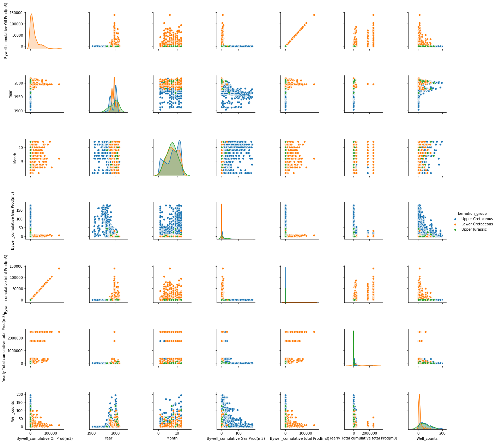
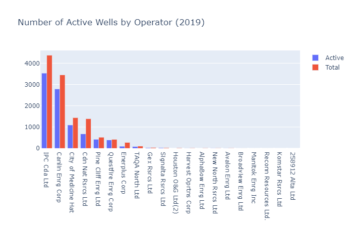
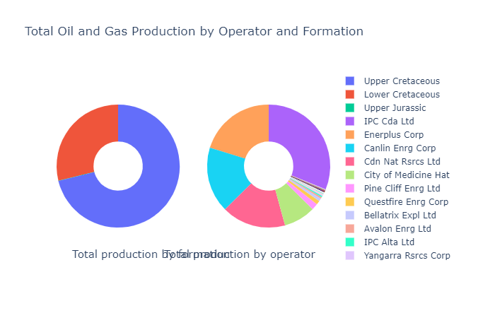

# Introduction

The city of Medicine Hat, Alberta recently announced that they will be shutting in 2,000 active natural gas wells due to low gas prices . Our project group proposes an illustrative history of oil and gas production in the Medicine Hat area to provide context on this decision.

# Data Source

The dataset for this project consists of well information and production data associated to oil and gas wells. It was sourced from GeoScout; a databasing and mapping software program owned by GeoLogic Systems Inc. Public production and well data, collected by the Alberta Energy Regulator, is aggregated by Geologic Systems in the GeoScout platform. GeoScout is licensed to the University of Calgary for non-commercial use and was accessed via the University of Calgary Geosciences laboratory.

The queried wells were within a 75 km radius of Medicine Hat. The data is shaped in two tables: one of well header data, and one of production data. Both tables were exported into .csv format.

**Well Header Data**

The well header .csv file features one well per row, with approximately 15,000 wells. Each well has 243 different attributes which include information such as: well name, latitude/longitude location, operator, drilling date, formation, and production summaries.

**Production Data**

The production .csv file contains rows with well identifiers and production measure combinations (19 per well); the columns have the associated volume or rate by month. The overall file of approximately 13,000 wells, 19 rows per well, and 694 month columns for an approximate 800MB size.

We will be culled the dataset to the last 20 years worth of prouction for use in some of our analysis.

## Data Exploration by Seaborn 
This visualization merges the well header with the formation groupings so that we can compare data pairs by formation.

The primary purpose of this analysis was simple to explore what data features.

## New Wells Drilled variation with Gas Price
The primary purpose of this analysis was simple to explore what data features.

## Map of gas wells colored by Operator
The primary purpose of this analysis was simple to explore what data features.

## Number of wells drilled by each operator
The primary purpose of this analysis was simple to explore what data features.

## Boxplots by formation
All of the oil production is coming form the Lower Cretaceous whereas gas is from the Upper Cretaceous and Upper Jurassic.

